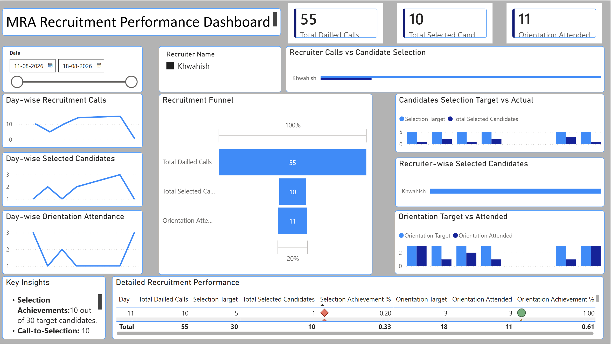

# MRA Recruitment Dashboard – Power BI

## 📌 Project Overview

An interactive Power BI dashboard developed to analyze recruitment performance, track candidate progress, and monitor key hiring metrics.

## 🎯 Objective

The objective of this project is to analyze recruitment data, monitor the recruitment funnel, compare recruiter performance, and identify gaps between candidate selection and orientation.

## 🛠️ Tools and Technologies

- Power BI
- Power Query
- DAX
- Excel / CSV
- Data Cleaning & Transformation
- Data Visualization

## 📊 Key Metrics

- Total Dialled Calls
- Selected Candidates
- Orientation Attended
- Selection Conversion
- Orientation Conversion
- Recruiter-wise Performance

## 💡 Key Insights

- Analyzed overall recruitment funnel performance.
- Compared performance across recruiters.
- Identified the gap between selected candidates and orientation attendance.
- Monitored candidate progression through different recruitment stages.
- Used interactive filters and visualizations to support data-driven analysis.

## 🖼️ Dashboard Preview

## 📁 Files in this Repository

- `MRA_Recruitment_Dashboard.pbix` – Power BI dashboard file
- `MRA_Recruitment_Datasets.csv` – Dataset used for analysis
- `Dashboard_view.png` – Dashboard preview image
- `README.md` – Project documentation

## 📂 Project Type

**Data Analytics | Business Intelligence | Recruitment Analytics**

## 👩‍💻 Author

**Saziya Naushad**

Data Analyst | Power BI | SQL | Excel | Python
